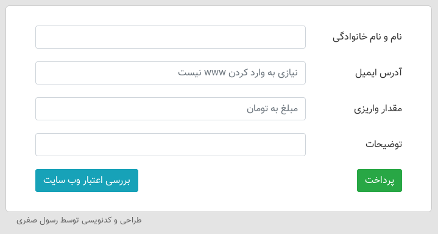

# اسکریپت پایتون آسان پرداخت برای زرین پال



<div dir='rtl' align='right'>
<p>این اسکریپت با استفاده از پایتون ۳ و فریم ورک Bottle ساخته شده است.</p>
<h4>پیشنیازها:</h4>
<ul>
    <li>پایتون ۳</li>
        <ul>
            <li>نصب ماژول‌های پایتون از داخل فایل requirement.txt</li>
        </ul>
    <li>وب سرور ( آپاچی یا و... ) *اختیاری</li>
    <li>بانک اطلاعاتی MySQL</li>
</ul>
<h4>آموزش نصب:</h4>
<p>ابتدا فایل config.py را ویرایش کرده و اطلاعات مربوط به بانک اطلاعاتی و مرچنت کد دریافتی از زرین پال را وارد نمایید سپس آدرس مربوط به نمایش سایت را نیز باید ویرایش نمایید.</p>
<p>حال باید اسکریپت را با دستور زیر اجرا نمایید.</p>

```
python3 main_application.py
```

<p>اکنون اسکریپت از طریق آدرس زیر در دسترس است:</p>

```
http://localhost:8080
```

<p>* درصورتی که نمی‌خواهید از وب سرور استفاده کنید پورت 8080 را می‌توانید با ویرایش آخرین خط فایل main_application.py به پورت مورد نظر تغییر دهید.</p>
<p>در اولین اجرا لازم است شاخه‌ی /install را اجرا نمایید تا جداول مربوط در بانک اطلاعاتی ایجاد گردد ، به عنوان مثال:</p>

```
http://localhost:8080/install
```

<h4>استفاده از وب سرور آپاچی</h4>
<p>در آپاچی می‌توانیم به صورت Reverse-Proxy نیز از این اسکریپت استفاده کنیم.</p>
<p>برای اینکار باید ماژول های زیر فعال باشد:</p>

```
proxy, proxy_ajp, proxy_http, rewrite, deflate, headers, proxy_balancer, proxy_connect, proxy_html
```

<p>یک سایت جدید ایجاد می‌کنیم:</p>

```
sudo nano /etc/apache2/sites-enabled/zarinpal-easypay.conf
```

<p>سپس تنظیمات زیر را در آن وارد می‌کنیم:</p>
    
```
<VirtualHost *:80>
    ProxyPreserveHost On
    ProxyPass / http://0.0.0.0:8080/
    ProxyPassReverse / http://0.0.0.0:8080/
    ServerName YourDomain.com
    ServerAlias www.YourDomain.com
</VirtualHost>
```
<p>سپس با کلید های Ctrl+X و پس از آن Y فایل را ذخیره می‌کنیم.</p>

```
sudo systemctl reload apache2
```

<p>حال با استفاده از آدرس زیر به اسکریپت دسترسی داریم:</p>

```
http://YourDomain.com
```
</div>